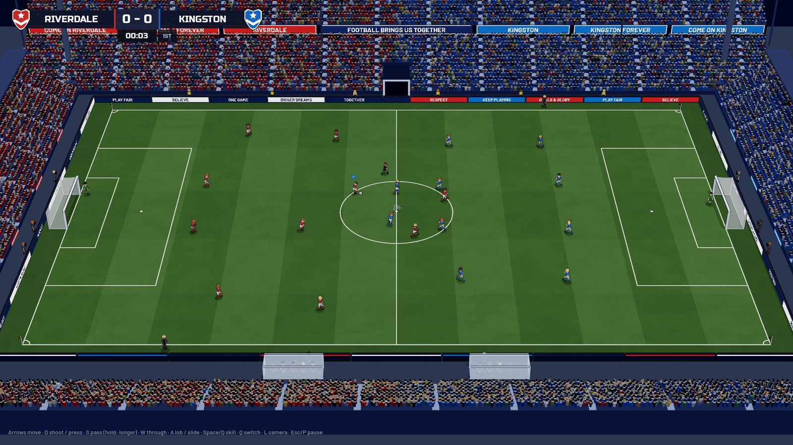
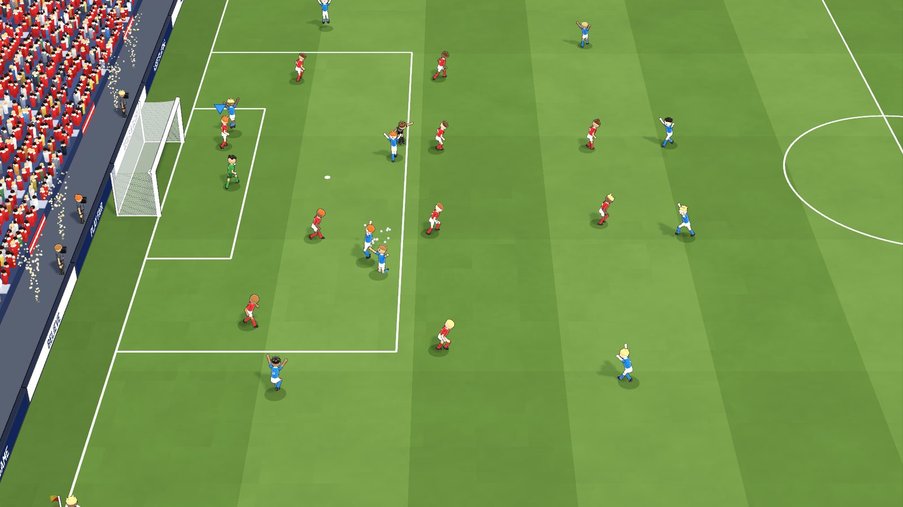
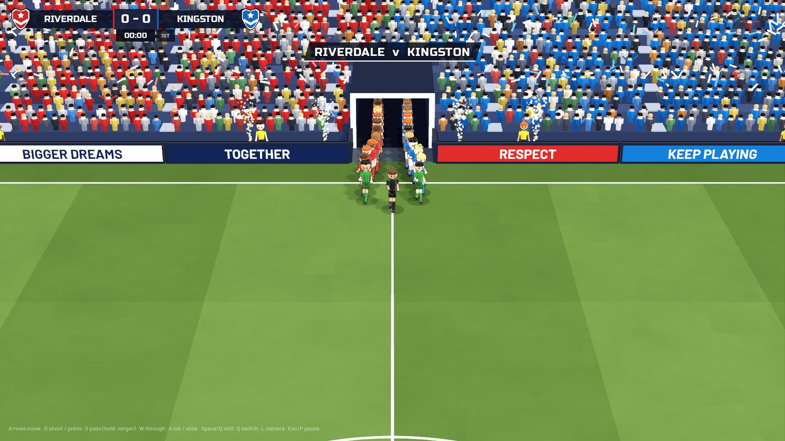
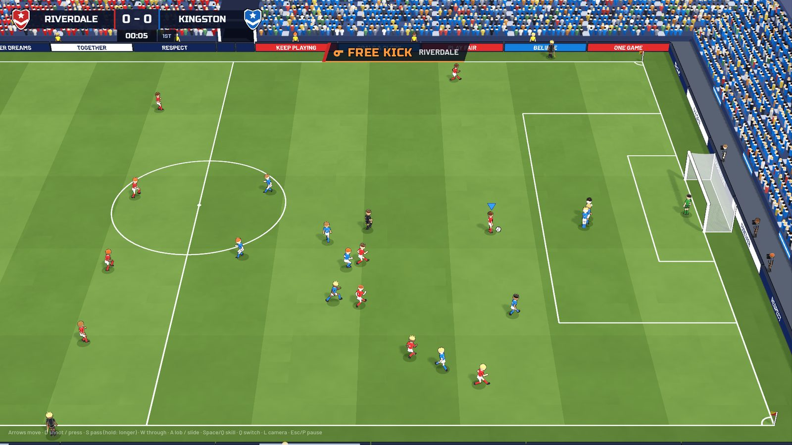
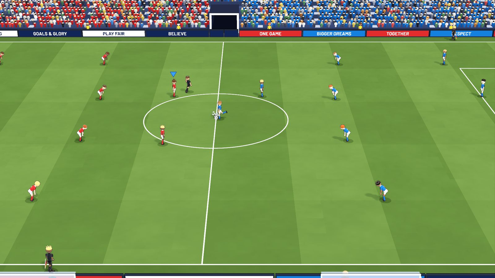
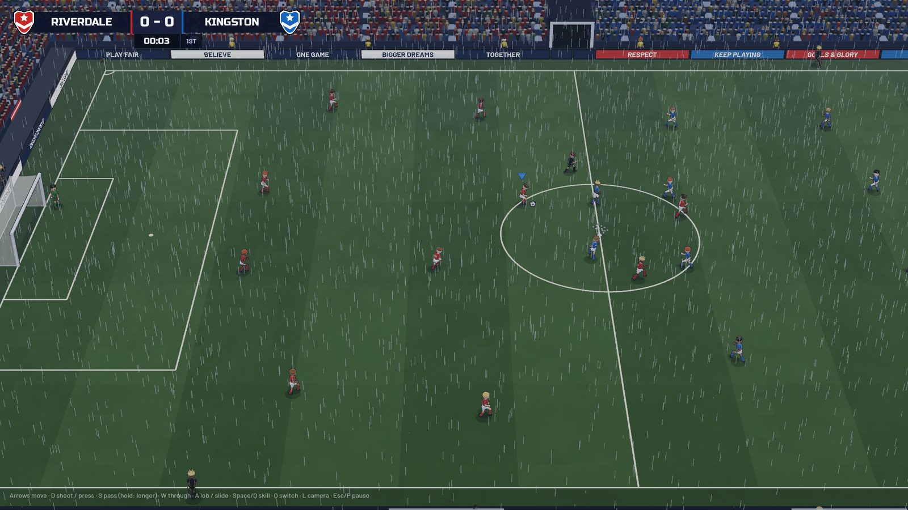

# Noname Soccer

**Play football. Don't manage it.**

Arcade-style 11 v 11 soccer — full pitch, cute players, honest rules.
No attributes, no stamina bars, no tactics sliders. Just the match.

<p align="center">
  
</p>

<p align="center">
  <a href="https://halilibrahimkalkan.com/noname-soccer/play/"><strong>Play in browser</strong></a>
  &nbsp;·&nbsp;
  <a href="https://halilibrahimkalkan.com/noname-soccer/">Landing page</a>
  &nbsp;·&nbsp;
  <a href="https://github.com/hikalkan/noname-soccer/releases/latest"><strong>Download</strong></a>
</p>

## Screenshots

| Goal | Walkout | Free kick |
|:---:|:---:|:---:|
|  |  |  |

| Close camera | Night | Rain |
|:---:|:---:|:---:|
|  |  |  |

## Play

| | |
|---|---|
| **Browser** | [halilibrahimkalkan.com/noname-soccer/play/](https://halilibrahimkalkan.com/noname-soccer/play/) — desktop with keyboard or gamepad |
| **Windows** | [NonameSoccer-windows-x64.zip](https://github.com/hikalkan/noname-soccer/releases/latest/download/NonameSoccer-windows-x64.zip) — unzip, run `NonameSoccer.exe` |
| **macOS** | [NonameSoccer-macos.zip](https://github.com/hikalkan/noname-soccer/releases/latest/download/NonameSoccer-macos.zip) — Universal (Apple Silicon + Intel) |

Portable builds only — no installer. Settings stay in your user profile:

- Windows: `%APPDATA%\Godot\app_userdata\Noname Soccer\`
- macOS: `~/Library/Application Support/Godot/app_userdata/Noname Soccer/`

**First open notes**

- Windows SmartScreen may warn once → *More info* → *Run anyway*.
- macOS: Control-click the app → *Open* → *Open*. If Gatekeeper says it is damaged:
  ```bash
  xattr -dr com.apple.quarantine "Noname Soccer.app"
  ```

## Philosophy

The only edge is playing better. Nothing in a menu puts anyone ahead before kickoff.

- **Equal players** — no pace, shooting, or height stats; shirt numbers 1–11 are identity only
- **No condition systems** — no stamina, form, morale, or injuries that change the match
- **No progression** — no XP, levels, or upgrades
- **No tactics management** — a few balanced formations, locked for the match
- **No hidden modifiers** — no momentum scripting, home advantage, or weather physics
- **Small control set** — move, pass, through, lob, shoot, skill, switch

Difficulty only changes how well the CPU decides — never the physics, never your teammates.

## Controls

| Action | Keyboard | Gamepad |
|---|---|---|
| Move | Arrows | Left stick |
| Shoot / press | D | B |
| Pass | S | A |
| Through pass | W | Y |
| Lob / slide | A | X |
| Skill / shield | Space / Q | RB |
| Switch player | Q | LB |
| Camera | L | — |
| Pause | Esc / P | Start |

Couch 2P: P1 keyboard (or pad), P2 gamepad. Full list is in the in-game **How to Play** screen.

## What's in this repo

Published site only (not the game source):

- Landing page (TR / EN) at the root
- Godot web build under [`play/`](play/)
- Gallery images under [`img/`](img/)

Desktop zips ship as [GitHub Releases](https://github.com/hikalkan/noname-soccer/releases/latest).

## License / notes

Independent arcade football. Original team names only — no real clubs or players.
Fonts on the landing page: Russo One & Barlow (OFL).
